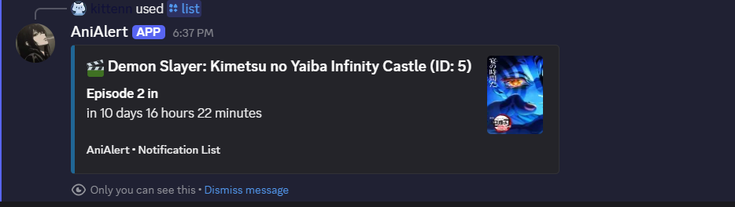

# AniAlert - Made with [discord.py](https://discordpy.readthedocs.io/en/stable/)

AniAlert is a Discord bot that helps anime fans track their favorite shows, get notified when episodes air, and discover seasonal anime.  



## 🤖 Commands

| Command                   | Description                                      |
|---------------------------|------------------------------------------------|
| `/search_anime`            | Search for anime by title with optional filters |
| `/seasonal_anime`          | Browse this season's airing anime                |
| `/random_anime_suggestion` | Get random anime recommendations by genre       |
| `/list`                   | View your notification list                      |
| `/remove_anime`            | Remove an anime from your notification list      |
| `/clear_list`              | Clear your entire notification list              |


## 🚀 Getting Started

# 1. Clone the AniAlert repository

```bash
git clone https://github.com/ganraoyu/AniAlert.git
```

### 2. Create and activate a virtual environment

```bash
# On macOS/Linux
python3 -m venv venv
source venv/bin/activate

# On Windows (PowerShell)
python -m venv venv
.\venv\Scripts\Activate.ps1

# Or Windows (cmd)
.\venv\Scripts\activate.bat
```

### 3. Install dependencies in editable mode

```bash
pip install -e .
```

> This installs AniAlert in “editable” mode so changes to the source code take effect immediately.

### 4. Create a `.env` file

```env
DISCORD_TOKEN=your_discord_bot_token
CLIENT_ID=your_client_id
```

### 5. Run the bot

```bash
python bot.py
```

---

## 🗂 Project Structure

```
AniAlert/
├── bot.py                # Main entry point for the Discord bot
├── cogs/                 # Command modules (slash commands, etc.)
├── db/                   
│   ├── database.py       # DB connection and queries
├── providers/            # External API integrations (Anilist, Kitsu, etc.)
├── services/             # Business logic for searching, notifications, etc.
├── utils/                # Helper functions and shared utilities
├── views/                # Discord UI elements like buttons, views, menus
└── tests/                # Unit and integration tests
```

To run all tests using pytest:

```bash
pytest
```
